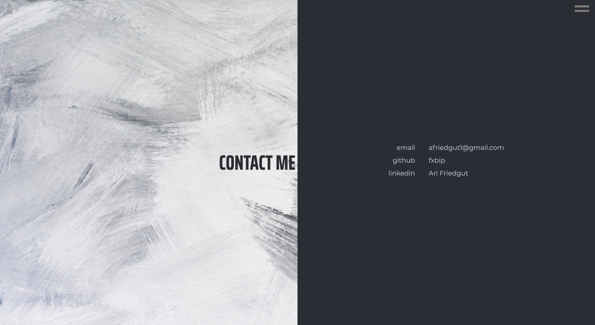
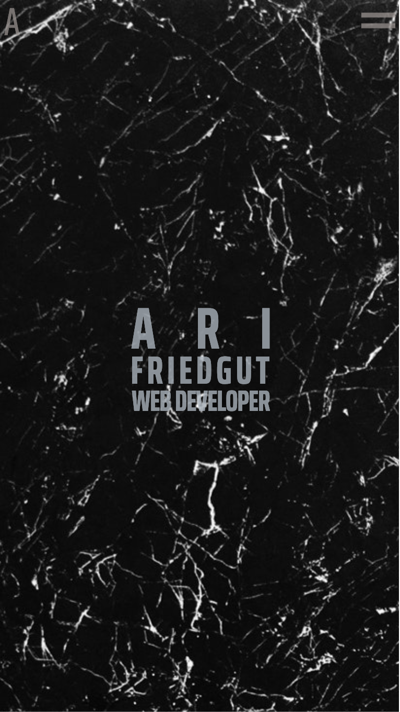

# Ari Friedgut's Online Portfolio

## [The Portfolio](https://fxbip.github.io)  

## [The Github](https://github.com/fxbip/portfolio)  

## Description

### Purpose

The purpose of my portfolio website is to have a hub on the internet where I can get my name as a web developer out into the world by showing my sense of design, the projects I have worked on and linking to other sites where I have hosted content of my own, such as github.

### Functionality/Features

* Sleek and minimal design
* Clickable dropdown menu from the hamburger icon in the top right of the page, built in pure css, takes to different areas of the site (as does scrolling)
* 'A' logo in the top right returns user to home page when clicked
* Heading on home page animates in from an opacity of 0 to an opacity of 1
* Different site configuration for mobile use vs desktop use, achieved through css breakpoints
* About section, with a small introduction to who I am and my study and work history. Div for the info has overflow scroll
* Work section, displaying the projects I have worked on. Will add to this with each project I have a hand in making
* Contact Me section, with my email address, links to my github and my linkedin

### Sitemap

[sitemap](./src/sitemap.xml)

### Screenshots

  
  
  
  

### Target Audience

* Employers who are looking for a full stack developer with a good eye for minimalist design.

### Tech Stack

* HTML
* CSS
* Github

## Design Documentation

### Design Process

* I had an idea for how I wanted my site layout to work before anything else
* After this, I spent a while coming up with the perfect color pallet. I wanted cool, sleek colors to show sophistication.  
  
* I wire framed by website. First I did a low fi wire frame on an A4 sheet of paper (this wasunfortunately lost due to water damage). Then I did a more hi-fi wire frame on butcher's paper.
* I found stock images on pexels that I could use for the background images of my website. I was looking for minimal textures that would complement the colour scheme of my website.
* I looked for my fonts on Google Fonts. I was looking for simple, sans-serif fonts that had a sleek look that would fit in with my vision. The fonts I chose were Saira Extra Condensed for the headings and menus and Montserrat for the rest.

### Wire Frames

### Usability Considerations

I designed my website to be stark and minimal and therefore increase usability via reduction of clutter. Added alt tags for pertinent images for the benefit of a screen reader.

## Details of Planning Process

### Project Plan & Timeline

1/3 day 1 - wire framing  
1/3 day 1 - color scheme  
1/3 day 1 - background images  
1/2 day 2 - hamburger dropdown menu pure css
1/2 day 2 & 1/3 day 3 - main heading text alignment
1/3 day 3 - body layout
1/3 day 3 - breakpoints
2/3 day 4 - fixing various issues
1/3 day 4 - css sprinkles
1/2 day 5 - final touches
1/2 day 5 - README.md
day 6 - presentation & submit

### Screenshots of Trello Board

  
  
  
  
  
  
  
  
  

## Short Answer Q&A

### Describe key events in the development of the internet from the 1980s to today

### Define and describes the relationship between fundamental aspects of the internet such as: domains, web servers, DNS, and web browsers

### Reflect on one aspect of the development of internet technologies and how it has contributed to the world today 